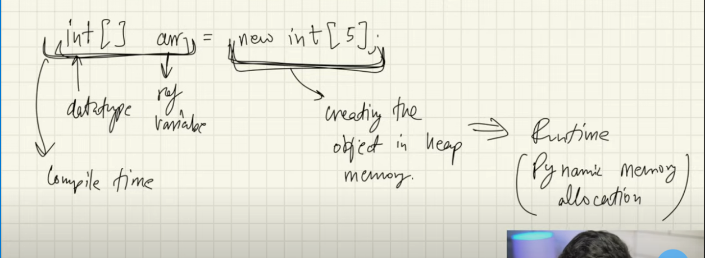
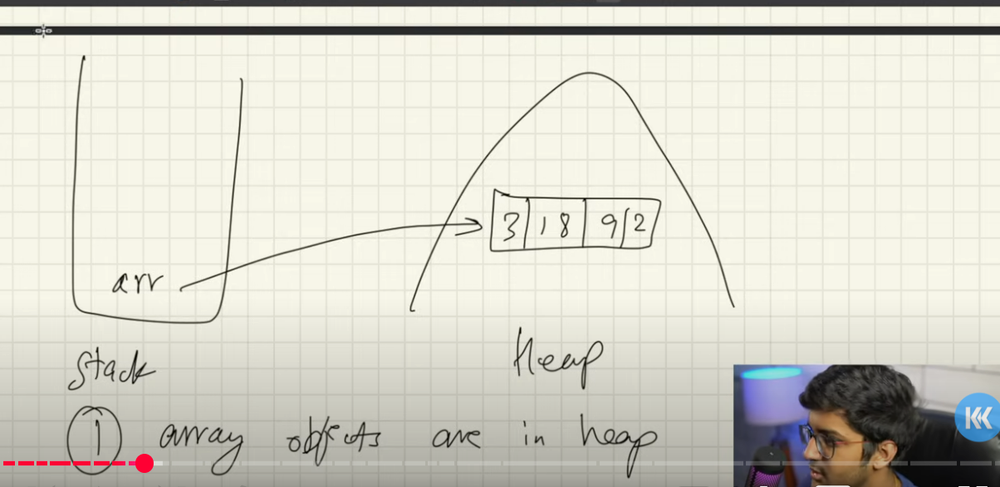
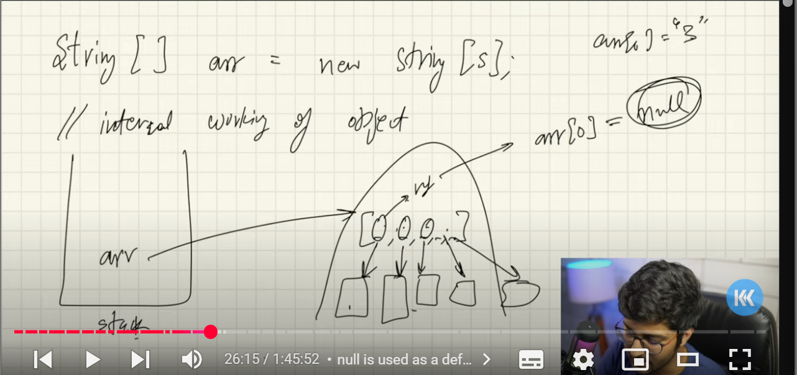
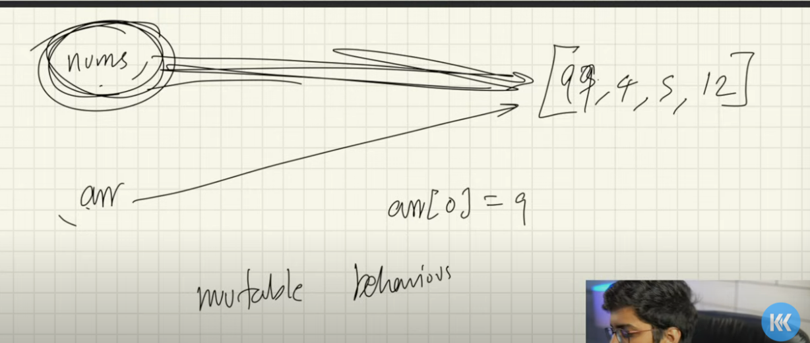
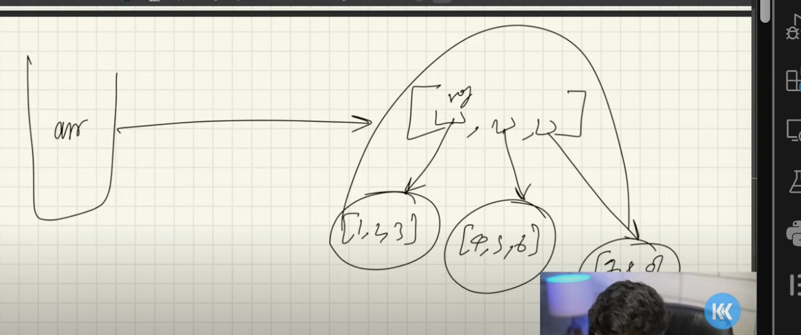
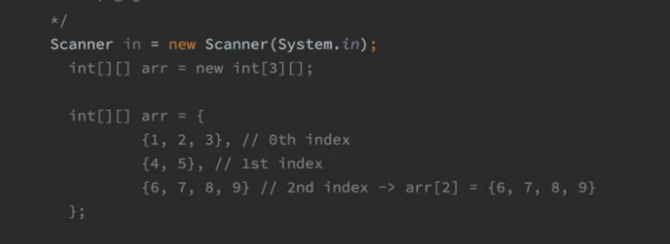
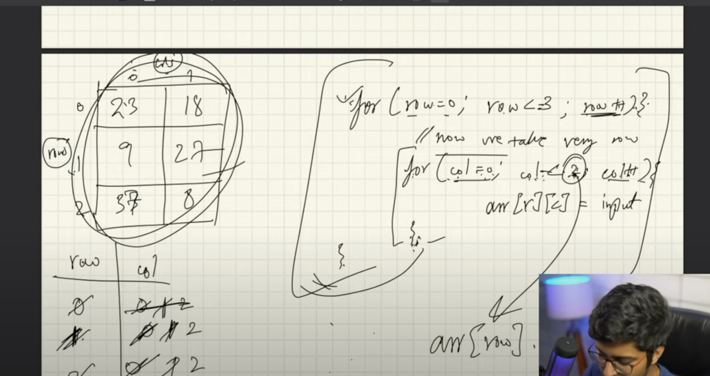

int[] arr=new int[5] 
int[]-dataypte
arr-reference variable 
int [] arr- this happens at compiler time:, this is the initialization
new int[5]-object is being created in the heap memory-this is is the declaration and this happens at run time

this is called Dynamic Memory allocation-at the run time memory is allocated

array is a continuous memory allocation
it totally depend on the jvm whether it is going to be continuous or not

1.we know  array objects are created in heap
2.heap object are not continous, java says that 
3.Dyanmic memorey allocation
as array is stored in heap memory and array also may not be continuous 
even though the definition say that it  "array is conitnous memory allocation"
new is the keyword that is used to create an object

when we create array of string
String arr[]=new String[5];
this has five values and 
initially arr[0]=null;
it points to null
primtive cannnot be brokend down into futher data types
and non primitive can be brokend down into further data types

you can print the array using this method too
System.out.ptintln(Arrays.toString(arr));

array of objects:
String[] str=new String[4];
for(int i=0;i<)

Arrays.toSting()-this is the best way of printing the arrays, you dont even have to use for loop to print, you can simply use this function

lets take a code example
import.java.util.Arrays;
import java.util.Scanner()
class one
{
    public static void main(string args[])
    { int size;
        int arr[]=new int[size]
        Scanner sc=new Scanner(System.in)
        System.out.println("Enter the size of the array");
        int size=sc.nextInt();
        for(int i=0;i<=size;i++)
        {
            System.out.println("Enter the elements in the array");
            arr[i]=sc.nextInt();
        }
        System.out.println(Arrays.toSting());
        
    }
}

Using function to change the values in the array:

Arrays are mutable in java but string are not mutuable in java

import.java.util.arrays;
public class PassinginFuntions{
    public static void main(String args[])
    {
        int[] nums={3,4,5,12};
        System.out.println(Arrays.toString(nums));
        change(nums);
        System.out.println(Arrays.toString(nums));  
    }
    static void change(int arr[])
    {
        arr[0]=99;
    }
}

Multidimensinonal arrays

rows= left and right
colums= up and down

array is stored in the heap memory as it is non primitive data types

how is mutlidimensiomal  array stored:

each row is stored in a different array
so if there are three rows then three arrays will be stored in the heap memory:
for example we have array like this:
{1,2,3
 4,5,6
 7,8,9}
 so how does 2D array works basicaly
 its array inside an array:
 these will be divided into three arrays
 [1,2,3] [4,5,6] [7,8,9]

 arr[0]- will point to the first [1,2,3]
 arr[1]- will point to the second[4,5,6]
 arr[2]- will point to the third[7,8,9]

 
 this is how the 2d array would work:
 the 0th index would store the first row 
 the first index would store the second row
 the second index would store the third row

  
 this is how the 2D array works
 first we run a simple for loop for to take the input for the rows
 and then we run the column loop till row.length 
  for(row=0;row<=3;row++)
  {
    for(col=0;col<=arr[row].length;col++){
        arr[i]=sc.nextInt();
    }
  }

lets take a program example of taking input of 2D array and printing it 
import java.util.Scanner;
Public class 2D
{
    public static void main(String args[])
    {
        int arr[][]=new int[3][3];
        Scanner sc=new Scanner(System.in);
        //input 
        
        for(int row=;row<arr;length;row++)
        {
            for(int col=0;col<arr[row].length;col++)
            {
                System.out.println("Enter the elements in the 2D array");
                arr[row][col]=sc.nextInt();
            }
        }
        //output, now lets print this 
         
        for(int row=;row<arr;length;row++)
        {
            for(int col=0;col<arr[row].length;col++)
            {
                System.out.println(arr[row][col]+""); 
            }
            System.out.println(); this is necessary to print in the form of matrix otherwise it will print the whole array in one line 
    }
}

we can even use the Arrays.toString  to print the elements in 2D array like this 
for(int row=0;row<arr.length;row++)
{
    System.out.println(Arrays.toString(arr[row]));
}

and you can even use enhanced for loop, if you want to make it shorter
for(int[] a:arr)
{
    System.out.println(Arrays.toString(a));
}

arr[row].length-Explanation
class row
{
    public static void main(String args[])
    int arr[][]={
                {1,2,3,4},
                {5,6},
                {7,8,9}};
    }
    for(int row=0;row<arr.length;row++)
    {
        for (int col=0;col<arr[row].length;col++)
        {
            System.out.print(arr[row][col]+" ");
        }
        System.out.println();
    }

}

in this given 2d array the length of the row is changing 
in  the first row the length is 4
and in the second and third is 2 and 3 
so we  have to use arr[row].length

Now lets jump into ArrayList

so why do we need ArrayList in the first place:
so arrays are good but they are of fixed sized we need to define the size at the begining but what if we don't know how much size we would need, arraylist can change its size automatically

What are the main advantage of arraylist and why do we use in in the first place?

Why Do We Use ArrayList? (Advantages)
1. Dynamic Size

Regular array: Fixed size (like a box that can't change)
ArrayList: Can grow or shrink (like a magic box that expands)

2. Easy to Use

You don't need to worry about size
Just keep adding items, it handles the rest

3. Lots of Helpful Methods

add() - put something in
remove() - take something out
get() - look at something
size() - count how many items
contains() - check if something exists

4. No Memory Waste

Only uses as much space as needed
Automatically manages memory for you -> this  is the most important reason why we use arraylist over arrays there is no wasteage of memory 

Let's take an example and do a simple comparison:

array Example

int arr []=new String[3];
{
    for(int i=0i>3;i++)
    {
       System.out.println("Enter three names);
       arr[i]=sc.nextLine();  -> this is how we take input as a String
    }
    
}

Arraylist example

ArrayList<String> Friends= new ArrayList<>();  ->  this can hold as many names as you would like
friends.add("Friend 1")
friends.add("Friend 2")

When to use ArrayList:
Use ArrayList when:

You don't know how many items you'll have
You want to add/remove items frequently
You want easy methods to work with your data
You want the program to handle size automatically

Lets take a simple example of List

import java.util.ArrayList;
public class SimpleList{
    public static void main(String args[])
    {
        ArrayList<Integer> N=new ArrayList<>();

        // now you can add elements to the arraylist N
        N.add(1);
        N.add(2);
        N.add(5);
        
        //Now you can even remove a number using remove function
        N.remove(2); // this will remove element at index number 2 

        System.out.println("ArrayList="+N);
    }
}

Linear Search:
let's take a simple example of linear search:

public class LS{
    public static void main(String args[])
    {
        int arr[]={18,12,9,14,77,50};
        //find whether 14 exists in array or not.
        int n=14;
        boolean found=false;
        for(int i =0;i<arr.length;i++)
        {
            if (arr[i]==n)
            {
                found=true;
                break;
            }
        }
        if(found)
        {
            System.out.println("the number is present");
        }
        else{
            System.out.println("the number is not present");
        }
    }
}

Time complexity of linear search and Time complexity expainnation in General:

time complexity is 
so basically time complexity means how much time would your program take to run as the size of the elements increase 
for example if the if you are doing  a linear search and the elemnet is present at the beginning , so the time it will to to find this elemnent will be N
it does not matter how big the array it will take constant time - this is the best case scenario, so the time complexity for best case scenario is O(1):

and if we have an searching for an element that is not present in an array the time will inrease as the size of the array increases this is linear time complexity: and for worst case scenario is O(n)

lets write the same code using function:
import java.util.Scanner;
class Main{
    public static void main(String args[])
    {
        int num[]={2,4,55,6,19,77,99};
        int target=19;
        int ans=linearSearch(nums,target);
        System.out.println(ans);
    }
    static int linearSearch(int arr[], int target)
    {
        if(arr.length==0)
        return -1;
        for(int index=0;index>arr.length;i++)
        {
           int element=arr[index];
           if(element==target){
            return index;
           }
          return -1;
    }
}